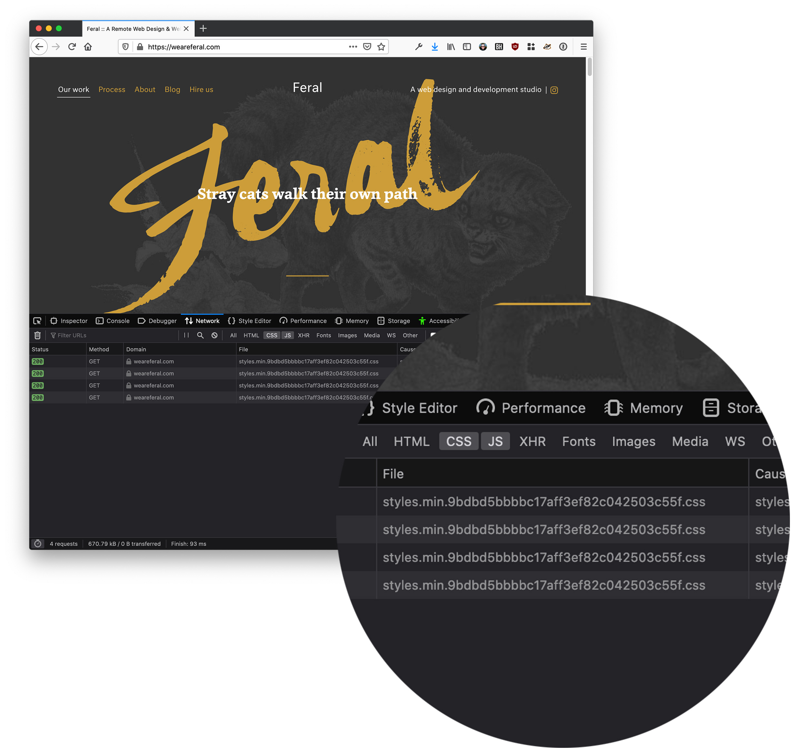
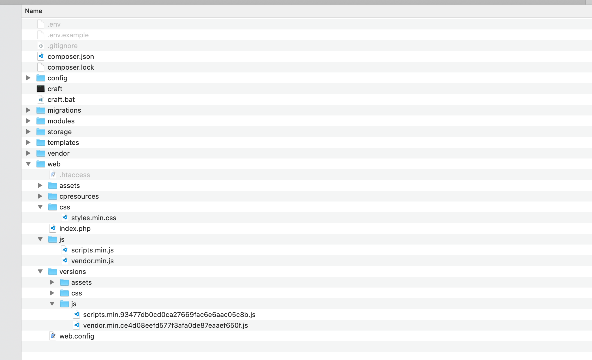

# File Versioner


Automatically generate unique hashed versions of static files and asset files for efficient and reliable browser caching.

## Overview



This plugin automatically generates cache-busting hashed versions for both the _static_ files within your webroot (JS, CSS, fonts etc.) as well as volume _assets_ uploaded by users.

For _static_ files, it does this by creating a `scan` command that you can run on every deployment:

```sh
./craft file-versioner/static-files/scan
./craft file-versioner/asset-files/scan
```

Which can be accessed in your template via a `v` template filter:

```html
<link
  rel="stylesheet"
  href="{{'/css/styles.min.js'|v }}"
  type="text/css"
  charset="utf-8"
/>
```

For _asset files_, the versioning happens automatically when a new file is uploaded.

## Background

When serving files in production it's common to configure your web server to avail of browser-caching by using the `Cache-Control` header. This instructs the user's browser to keep a local version of a particular file rather than contacting the server. This saves network requests and improves performance.

A common problem with browser-caching arises when a file's content changes. How does the browser know it's changed? If you told the browser to keep that file for 2 week it won't ask for that file again until then, meaning it will continue to have the old stale version.

File versioning is a solution to this. The idea is that you append a hash to the end of the file:


This means that when the content of the file changes, the hash also changed. When the _hash_ changes, the URL changes. This means the user's browser will now always get the latest file, but will still avail of caching when that file remains unchanged.

#### Versioning Challenges

Actually implementing file versioning can be difficult. A website usually has two families of files:

- **Static files**: these are the files used during _development_. Think of them as your 'build-time' files
- **Asset files** these are the files uploaded during _regular usage_ by the end-user. Think of them as your 'run-time' files

For static files you _could_ manually version them by using a system like `styles.v1.css` `styles.v2.css` etc. but this is tedious and error prone. You could alternatively use your frontend task runner like gulp to do it for you, but this also requires manual intervention.

For asset files there are even less options. You could ask clients to manually version files before uploading them but this is unlikely to be adhered to.

#### Solution

The solution is to automatically version both static files and asset files. This plugin handles this by offering 'build-time' CLI commands that automatically version static files during deployment as well as transparent 'run-time' processing the automatically versions all user-uploaded assets.

[Read more in our blog post about file versioning](https://weareferal.com/blog/cache-busting-and-asset-versioning-with-craft-cms/)

## Requirements

This plugin requires Craft CMS 3.0.0 or later.

## Installation

To install the plugin:

1. Open your terminal and go to your Craft project:

   ```sh
   $ cd /path/to/project
   ```

2. Then tell Composer to load the plugin:

   ```sh
   $ composer require weareferal/file-versioner
   ```

3. In the Control Panel, go to Settings → Plugins and click the _Install_ button for File Versioner.

## Configuration

Copy the example configuration file from the repo `config/file-versioner.example.php` to `config/file-versioner.php` in your project:

```php
<?php

return [
    '*' => [
        'staticVersioningEnabled' => false,
        'assetVersioningEnabled' => false,
    ],
    'production' => [
        // Whether or not to enable versioning for static files specifically.
        // Static files are the JS, CSS, png, jpeg, fonts ... that you use
        // part of your development workflow
        'staticVersioningEnabled' => true,

        // The extensions of the static files you are interested in being
        // hashed. In this example, we are only hashing JS & CSS files
        'staticVersioningExtensions' => 'css,js',

        // The name of the folder within your webroot to storge copied, versioned
        // files. This makes it easy to add this folder to your gitignore so that
        // generated version files are not in your repo.
        'staticVersioningPrefix' => 'versions',

        // Whether or not to enable versioning for uploaded Craft asset files.
        // This may or may not be something you need.
        'assetVersioningEnabled' => true,

        // The extensions of the asset files you are interested in being hashed.
        'assetVersioningExtensions' => 'png,jpg,jpeg,pdf'
    ]
];
```

This configuration file allows you to control you versioning on a per-environment basis.

You should also add the `@webroot/versions` folder to your `.gitignore` for example:

```sh
...
web/versions
```

## Usage

### Static Files

To generate versioned static files, run the following command as part of your deployment:

```sh
./craft file-versioner/scan
```

#### Template Filter

To reference your static files from your template, use the `v` Twig filter:

```html
<script type="text/javascript" src="{{'/js/scripts.min.js'|v}}"></script>
```

This will render your versioned file transparently:

```html
<script
  type="text/javascript"
  src="/js/scripts.min.93477db0cd0ca27669fac6e6aac05c8b.js"
></script>
```

### Asset Files

For _new_ files that are uploaded via the Control Panel, you don't have to do anything - they will be automatically versioned.

## Behind the Scenes

Being the scenes the plugin keeps all versioned files in a separate `@webroot/versions` folder. This means your original files are never changed.

### Static Files

For static files, the `scan` command will automatically search for all files in your `@webroot` folder that match the extensions you enabled via `staticVersioningExtensions`.

It will automatically exclude the `cpresources` folder plus any volumes in your webroot so as not to duplicate versioned files or rename anything else unessessarily.



The files that it finds will be md5 hashed and that hash value will be appended to their filename, before the extension.

A mapping of un-versioned files to versioned files is kept in the Craft cache. When you use the `v` template filter, the plugin simply looks up the original file path in your cache.

## Caveats

There are a few caveats you should be aware of when developing with this plugin.

### Using versions in CSS or JS

You cannot access versioned files outside of your `.twig` files. For example, you might have a background image within your CSS file:

```css
.image {
  background-image: url("/images/background.png");
}
```

The `v` template filter is not available in your CSS files so you cannot access the versioned file. A workaround is to use inline styles, for example:

```html
<div
  class="image"
  style="background-image: url({{'/images/background.png'|v}})"
></div>
```

### Relative paths

Be careful using relative paths for static files within your versioned CSS or JS, they may cause 404s. For example:

```css
@font-face {
  font-family: "Font";
  src: url("../fonts/Font.eot");
  src: url("../fonts/Font.eot?#iefix") format("embedded-opentype"), url("../fonts/Font.woff2")
      format("woff2"), url("../fonts/Font.woff") format("woff"), url("../fonts/Font.ttf")
      format("truetype");
  font-weight: normal;
  font-style: italic;
}
```

As the above caveat mentioned, you can't version this font file. But because this uses a relative path, it will actually 404.

This is because all versioned assets are stored in a `versions` folder within you webroot. But this font file versioned at all, so doesn't exist in the `versions` folder.

Use absolute paths instead (to the non-versioned folder):

```css
@font-face {
  font-family: "Font";
  src: url("/fonts/Font.eot");
  src: url("/fonts/Font.eot?#iefix") format("embedded-opentype"), url("/fonts/Font.woff2")
      format("woff2"), url("/fonts/Font.woff") format("woff"), url("/fonts/Font.ttf")
      format("truetype");
  font-weight: normal;
  font-style: italic;
}
```

### Local volume files

Currently, this plugin only works with local files in you filesystem's webroot.

### Sourcemaps

Currently these won't work with versioning enabled. See for more:

https://github.com/weareferal/craft-file-versioner/issues/3

## Support


Brought to you by [Feral](https://weareferal.com). Any problems email [timmy@weareferal.com](mailto:timmy@weareferal.com?subject=Craft%20Env%20Sync%20Question) or leave an issue on Github.
